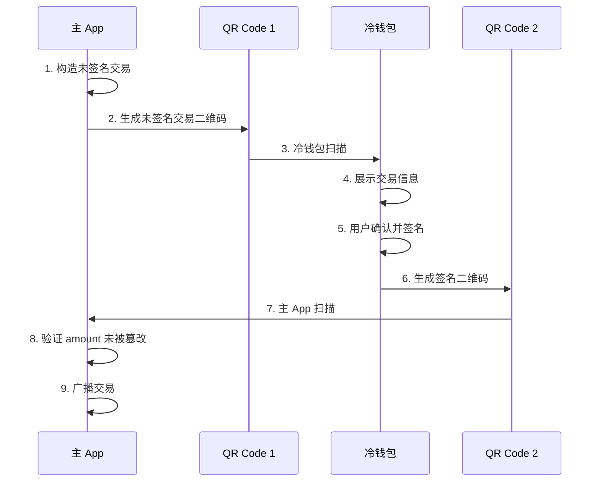

# 冷钱包扫码签名流程指南

## 📋 概述

冷钱包扫码签名流程允许通过二维码在主 App 和冷钱包之间安全传递交易数据，实现离线签名。

---

## 🔄 完整流程



---

## 📦 数据结构

### 未签名交易 QR（主 App → 冷钱包）

```json
{
  "v": "1.0",
  "type": "transfer",
  "from": "TXYZoPE5CP4Gj4K...",
  "to": "TAbcdeFGHIJKLMN...",
  "amount": 15000000,
  "refBlock": "base64_encoded_hash",
  "refBlockHeight": 12345678,
  "expiration": 1703520000000,
  "timestamp": 1703519940000,
  "rawData": "base64_encoded_raw_data"
}
```

**字段说明**：
- `v`: 协议版本
- `type`: 固定为 "transfer"
- `from`: 发送方地址
- `to`: 接收方地址
- `amount`: 转账金额（sun）
- `refBlock`: 引用区块哈希（Base64）
- `refBlockHeight`: 引用区块高度
- `expiration`: 过期时间（毫秒时间戳）
- `timestamp`: 交易时间戳
- `rawData`: 原始交易数据（Base64，用于签名）

---

### 已签名交易 QR（冷钱包 → 主 App）

```json
{
  "v": "1.0",
  "type": "transfer",
  "to": "TAbcdeFGHIJKLMN...",
  "amount": 15000000,
  "signature": "base64_encoded_signature",
  "signedTx": "base64_encoded_signed_transaction"
}
```

**字段说明**：
- `to`: 接收方地址（用于校验）
- `amount`: 转账金额（用于校验）
- `signature`: 签名数据（Base64）
- `signedTx`: 完整签名交易（Base64）

---

## 🎯 使用示例

### 主 App - 生成未签名交易二维码

```kotlin
// 1. 构造未签名交易
val transaction = TransactionBuilder().buildTransferTransaction(
    fromAddress = walletAddress,
    config = settingsConfig
)

// 2. 创建 QR 数据
val qrGenerator = MainAppQRGenerator()
val unsignedQR = qrGenerator.createUnsignedTransactionQR(
    transaction = transaction,
    fromAddress = walletAddress
)

// 3. 编码为 JSON 字符串
val qrString = QRCodec.encodeUnsignedTransaction(unsignedQR)

// 4. 生成二维码图片
val qrBitmap = qrGenerator.generateQRCodeBitmap(
    content = qrString,
    size = 512
)

// 5. 显示二维码
imageView.setImageBitmap(qrBitmap)

// 6. 保存原始数据用于后续验证
savedUnsignedQR = unsignedQR
```

---

### 冷钱包 - 扫描并签名

```kotlin
// 1. 扫描二维码获取字符串
val scannedString = scanQRCode()

// 2. 解码为未签名交易
val unsignedQR = QRCodec.decodeUnsignedTransaction(scannedString)

// 3. 展示交易信息给用户确认
showTransactionDetails(unsignedQR)

// 4. 用户确认后签名
val processor = ColdWalletQRProcessor()
val signedQR = processor.signAndCreateQR(
    unsigned = unsignedQR,
    walletManager = coldWalletManager
)

// 5. 编码为 JSON 字符串
val signedQRString = QRCodec.encodeSignedTransaction(signedQR)

// 6. 生成签名二维码
val signedQRBitmap = processor.generateSignedQRCodeBitmap(
    content = signedQRString,
    size = 512
)

// 7. 显示签名二维码
imageView.setImageBitmap(signedQRBitmap)
```

---

### 主 App - 扫描签名并验证

```kotlin
// 1. 扫描签名二维码
val scannedString = scanQRCode()

// 2. 解码为已签名交易
val signedQR = QRCodec.decodeSignedTransaction(scannedString)

// 3. 验证数据未被篡改
val verifier = SignatureVerifier()
val verificationResult = verifier.verify(
    originalUnsigned = savedUnsignedQR,
    signed = signedQR
)

when (verificationResult) {
    is VerificationResult.Success -> {
        // 4. 重建完整交易
        val signedTransaction = verifier.rebuildTransaction(signedQR)
        
        // 5. 广播交易
        broadcastTransaction(signedTransaction)
    }
    
    is VerificationResult.Failure -> {
        showError("验证失败：${verificationResult.message}")
    }
}
```

---

## 🔒 安全验证

### 主 App 验证流程

```kotlin
fun verify(
    originalUnsigned: UnsignedTransactionQR,
    signed: SignedTransactionQR
): VerificationResult {
    
    // 1. 验证接收地址
    if (originalUnsigned.toAddress != signed.toAddress) {
        return Failure("接收地址被篡改")
    }
    
    // 2. 验证金额（关键）
    if (originalUnsigned.amountSun != signed.amountSun) {
        return Failure("金额被篡改")
    }
    
    // 3. 验证交易类型
    if (signed.type != "transfer") {
        return Failure("交易类型错误")
    }
    
    return Success("验证通过")
}
```

---

## 📱 完整实现示例

### 主 App Activity

```kotlin
class MainAppActivity : AppCompatActivity() {
    
    private lateinit var savedUnsignedQR: UnsignedTransactionQR
    
    // 步骤 1: 生成未签名交易二维码
    fun generateUnsignedQR() {
        lifecycleScope.launch {
            try {
                // 构造交易
                val transaction = TransactionBuilder().buildTransferTransaction(
                    fromAddress = walletManager.getAddress()!!,
                    config = settingsConfig
                )
                
                // 生成 QR
                val qrGenerator = MainAppQRGenerator()
                val unsignedQR = qrGenerator.createUnsignedTransactionQR(
                    transaction, 
                    walletManager.getAddress()!!
                )
                
                // 保存用于后续验证
                savedUnsignedQR = unsignedQR
                
                // 显示二维码
                val qrString = QRCodec.encodeUnsignedTransaction(unsignedQR)
                val qrBitmap = qrGenerator.generateQRCodeBitmap(qrString)
                ivQRCode.setImageBitmap(qrBitmap)
                
                // 提示用户使用冷钱包扫描
                showMessage("请使用冷钱包扫描此二维码")
                
            } catch (e: Exception) {
                showError("生成二维码失败：${e.message}")
            }
        }
    }
    
    // 步骤 2: 扫描签名二维码
    fun scanSignedQR() {
        // 启动扫码
        scanQRCodeLauncher.launch(Intent(this, QRScanActivity::class.java))
    }
    
    // 步骤 3: 处理扫描结果
    private val scanQRCodeLauncher = registerForActivityResult(
        ActivityResultContracts.StartActivityForResult()
    ) { result ->
        if (result.resultCode == RESULT_OK) {
            val scannedString = result.data?.getStringExtra("QR_STRING")
            scannedString?.let { processSignedQR(it) }
        }
    }
    
    // 步骤 4: 验证并广播
    private fun processSignedQR(qrString: String) {
        lifecycleScope.launch {
            try {
                // 解码
                val signedQR = QRCodec.decodeSignedTransaction(qrString)
                
                // 验证
                val verifier = SignatureVerifier()
                val result = verifier.verify(savedUnsignedQR, signedQR)
                
                when (result) {
                    is VerificationResult.Success -> {
                        // 重建交易
                        val transaction = verifier.rebuildTransaction(signedQR)
                        
                        // 广播
                        broadcastTransaction(transaction)
                    }
                    
                    is VerificationResult.Failure -> {
                        showError(result.message)
                    }
                }
                
            } catch (e: Exception) {
                showError("处理失败：${e.message}")
            }
        }
    }
}
```

---

### 冷钱包 Activity

```kotlin
class ColdWalletActivity : AppCompatActivity() {
    
    private lateinit var walletManager: WalletManager
    
    // 步骤 1: 扫描未签名交易
    fun scanUnsignedQR() {
        scanQRCodeLauncher.launch(Intent(this, QRScanActivity::class.java))
    }
    
    private val scanQRCodeLauncher = registerForActivityResult(
        ActivityResultContracts.StartActivityForResult()
    ) { result ->
        if (result.resultCode == RESULT_OK) {
            val scannedString = result.data?.getStringExtra("QR_STRING")
            scannedString?.let { processUnsignedQR(it) }
        }
    }
    
    // 步骤 2: 展示交易详情
    private fun processUnsignedQR(qrString: String) {
        try {
            // 解码
            val unsignedQR = QRCodec.decodeUnsignedTransaction(qrString)
            
            // 展示详情
            showTransactionDetails(unsignedQR)
            
            // 等待用户确认
            btnConfirmSign.setOnClickListener {
                signTransaction(unsignedQR)
            }
            
        } catch (e: Exception) {
            showError("解码失败：${e.message}")
        }
    }
    
    // 步骤 3: 签名并生成二维码
    private fun signTransaction(unsignedQR: UnsignedTransactionQR) {
        lifecycleScope.launch {
            try {
                // 签名
                val processor = ColdWalletQRProcessor()
                val signedQR = processor.signAndCreateQR(
                    unsigned = unsignedQR,
                    walletManager = walletManager
                )
                
                // 生成二维码
                val qrString = QRCodec.encodeSignedTransaction(signedQR)
                val qrBitmap = processor.generateSignedQRCodeBitmap(qrString)
                
                // 显示
                ivSignedQR.setImageBitmap(qrBitmap)
                showMessage("请使用主 App 扫描此二维码")
                
            } catch (e: SecurityException) {
                showError("签名失败：${e.message}")
            }
        }
    }
    
    private fun showTransactionDetails(qr: UnsignedTransactionQR) {
        tvFrom.text = qr.fromAddress
        tvTo.text = qr.toAddress
        tvAmount.text = "${AmountUtils.sunToTrx(qr.amountSun)} TRX"
        tvExpiration.text = formatTimestamp(qr.expiration)
    }
}
```

---

## ⚠️ 注意事项

1. **保存原始数据**：主 App 必须保存原始的 `UnsignedTransactionQR` 用于验证
2. **验证金额**：扫描签名后必须验证 amount 未被篡改
3. **过期检查**：在广播前检查交易是否过期
4. **二维码大小**：建议使用 512×512 像素，确保扫描成功率
5. **错误纠正**：使用 ErrorCorrectionLevel.M 平衡容错和容量

---

**创建时间**: 2025-12-25  
**版本**: 1.0.0
