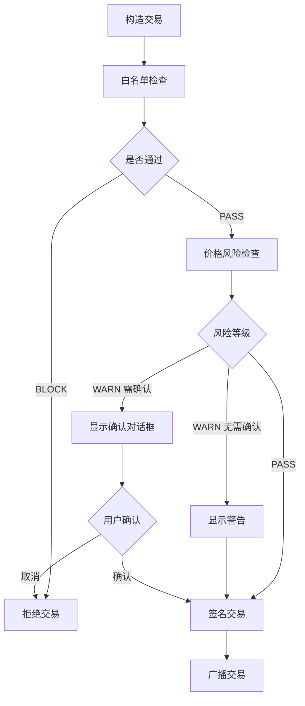

# 交易风控校验模块使用指南

## 📋 概述

RiskValidator 是一个多层风控校验器，通过白名单规则和风险等级判定确保交易安全。

---

## 🔒 风控机制

### 风险等级（RiskLevel）

```kotlin
enum class RiskLevel {
    PASS,   // 放行 - 安全，可继续
    WARN,   // 警告 - 有风险，但允许继续
    BLOCK   // 阻止 - 高风险，必须拒绝
}
```

---

## ✅ 白名单规则

**全部满足才放行，任一不满足则 BLOCK**：

| 规则 | 检查内容 | 失败后果 |
|------|---------|---------|
| 1. 交易类型 | 必须是 TransferContract | BLOCK |
| 2. Token 类型 | 必须是 TRX（隐式检查） | BLOCK |
| 3. Data 字段 | 必须为空 | BLOCK |
| 4. 金额正数 | amount > 0 | BLOCK |
| 5. 金额匹配 | amount == pricePerUnitSun × multiplier | BLOCK |

---

## ⚠️ 价格风险判定

| 单价范围 | 风险等级 | 需要确认 | 提示信息 |
|---------|---------|---------|---------|
| < 0.001 TRX | WARN | ❌ | 风险提示：单价异常低 |
| 0.001 ~ 1 TRX | PASS | ❌ | - |
| 1 ~ 10 TRX | WARN | ❌ | 高风险提示：单价较高 |
| > 10 TRX | WARN | ✅ | 高风险警告：需要二次确认 |

**阈值定义**：
```kotlin
PRICE_LOW_RISK_THRESHOLD = 1000 sun        // 0.001 TRX
PRICE_HIGH_RISK_THRESHOLD = 1_000_000 sun  // 1 TRX
PRICE_CONFIRMATION_THRESHOLD = 10_000_000 sun // 10 TRX
```

---

## 🎯 使用示例

### 基础使用

```kotlin
// 1. 创建风控校验器
val riskValidator = RiskValidator()

// 2. 准备配置和交易
val config = SettingsConfig(
    sellerAddress = "TXYZoPE5...",
    pricePerUnitSun = 5_000_000L, // 5 TRX
    multiplier = 3
)

val transaction = transactionBuilder.buildTransferTransaction(
    fromAddress = walletAddress,
    config = config
)

// 3. 执行风控检查
val result = riskValidator.checkRisk(transaction, config)

// 4. 处理结果
when (result.level) {
    RiskLevel.PASS -> {
        // 安全，继续签名和广播
        println("风控检查通过：${result.message}")
        signAndBroadcast(transaction)
    }
    
    RiskLevel.WARN -> {
        // 警告，需要提示用户
        if (result.requiresConfirmation) {
            // 必须用户确认
            showConfirmDialog(result.message) { confirmed ->
                if (confirmed) {
                    signAndBroadcast(transaction)
                }
            }
        } else {
            // 仅提示，不强制确认
            showWarning(result.message)
            signAndBroadcast(transaction)
        }
    }
    
    RiskLevel.BLOCK -> {
        // 阻止，拒绝交易
        println("风控拒绝：${result.message}")
        showError(result.message)
    }
}
```

---

### 仅检查白名单

```kotlin
val whitelistResult = riskValidator.checkWhitelistOnly(transaction, config)

if (whitelistResult.level == RiskLevel.BLOCK) {
    println("白名单检查失败：${whitelistResult.message}")
    return
}
```

---

### 仅检查价格风险

```kotlin
val priceRiskResult = riskValidator.checkPriceRiskOnly(priceSun)

when (priceRiskResult.level) {
    RiskLevel.WARN -> {
        if (priceRiskResult.requiresConfirmation) {
            showConfirmDialog(priceRiskResult.message)
        } else {
            showWarning(priceRiskResult.message)
        }
    }
    else -> { /* 正常 */ }
}
```

---

### 判断是否需要用户确认

```kotlin
val needsConfirmation = riskValidator.requiresUserConfirmation(transaction, config)

if (needsConfirmation) {
    showConfirmDialog("交易需要您的确认")
}
```

---

### 在 ViewModel 中使用

```kotlin
class TransferViewModel : ViewModel() {
    
    private val riskValidator = RiskValidator()
    
    fun performRiskCheck(
        transaction: Chain.Transaction,
        config: SettingsConfig
    ) {
        viewModelScope.launch {
            val result = riskValidator.checkRisk(transaction, config)
            
            when (result.level) {
                RiskLevel.PASS -> {
                    _uiState.value = TransferUiState.RiskCheckPassed
                }
                
                RiskLevel.WARN -> {
                    _uiState.value = TransferUiState.RiskWarning(
                        message = result.message,
                        requiresConfirmation = result.requiresConfirmation
                    )
                }
                
                RiskLevel.BLOCK -> {
                    _uiState.value = TransferUiState.RiskBlocked(result.message)
                }
            }
        }
    }
}
```

---

### 在 Activity 中显示风险确认对话框

```kotlin
private fun showRiskConfirmDialog(message: String, onConfirmed: () -> Unit) {
    AlertDialog.Builder(this)
        .setTitle(R.string.risk_confirm_title)
        .setMessage(getString(R.string.risk_confirm_message, message))
        .setPositiveButton(R.string.risk_confirm_proceed) { _, _ ->
            onConfirmed()
        }
        .setNegativeButton(R.string.risk_confirm_cancel) { dialog, _ ->
            dialog.dismiss()
        }
        .setCancelable(false)
        .show()
}

// 使用
when (riskResult.level) {
    RiskLevel.WARN -> {
        if (riskResult.requiresConfirmation) {
            showRiskConfirmDialog(riskResult.message) {
                // 用户确认后继续
                proceedWithTransaction()
            }
        }
    }
}
```

---

## 🔄 完整交易流程



---

## 📝 检查项详解

### 白名单检查

```kotlin
// 1. 交易类型检查
contract.type == Chain.Transaction.Contract.ContractType.TransferContract

// 2. Token 检查（隐式）
// TransferContract 只支持 TRX，无需额外检查

// 3. Data 检查
rawData.hasData() == false || rawData.data.size() == 0

// 4. 金额检查
transferContract.amount > 0

// 5. 金额匹配检查
transferContract.amount == config.pricePerUnitSun * config.multiplier
```

### 价格风险检查

```kotlin
when {
    priceSun < 1000 ->
        WARN("异常低价", requiresConfirmation = false)
    
    priceSun > 10_000_000 ->
        WARN("超高价", requiresConfirmation = true)
    
    priceSun > 1_000_000 ->
        WARN("高价", requiresConfirmation = false)
    
    else ->
        PASS
}
```

---

## 🚨 常见场景处理

### 场景 1：交易类型错误

```
结果：BLOCK
信息："白名单检查失败：交易类型为 TriggerSmartContract，仅允许 TransferContract"
处理：直接拒绝，不允许继续
```

### 场景 2：金额不匹配

```
结果：BLOCK
信息："白名单检查失败：金额不匹配（期望 15000000 sun，实际 10000000 sun）"
处理：直接拒绝，不允许继续
```

### 场景 3：异常低价

```
结果：WARN
信息："风险提示：单价异常低（0.0001 TRX），请确认是否正确"
requiresConfirmation：false
处理：显示警告，允许继续
```

### 场景 4：超高价

```
结果：WARN
信息："高风险警告：单价过高（15 TRX），需要二次确认"
requiresConfirmation：true
处理：显示确认对话框，用户确认后才能继续
```

---

## 💡 最佳实践

1. **总是执行完整检查**：
   ```kotlin
   // ✅ 推荐
   val result = riskValidator.checkRisk(transaction, config)
   
   // ❌ 不推荐（除非有特殊需求）
   val result = riskValidator.checkWhitelistOnly(transaction, config)
   ```

2. **处理所有风险等级**：
   ```kotlin
   when (result.level) {
       RiskLevel.PASS -> { /* 处理 */ }
       RiskLevel.WARN -> { /* 处理 */ }
       RiskLevel.BLOCK -> { /* 处理 */ }
   }
   ```

3. **尊重二次确认要求**：
   ```kotlin
   if (result.requiresConfirmation) {
       // 必须显示确认对话框
       showConfirmDialog()
   }
   ```

4. **记录风控结果**：
   ```kotlin
   Log.d("Risk", "风控检查结果：${result.level} - ${result.message}")
   ```

---

## 📊 测试用例

```kotlin
// 正常价格（0.1 TRX）
checkPriceRisk(100_000L) // PASS

// 异常低价（0.0001 TRX）
checkPriceRisk(100L) // WARN, requiresConfirmation = false

// 高价（5 TRX）
checkPriceRisk(5_000_000L) // WARN, requiresConfirmation = false

// 超高价（15 TRX）
checkPriceRisk(15_000_000L) // WARN, requiresConfirmation = true

// 边界值（0.001 TRX）
checkPriceRisk(1000L) // PASS

// 边界值（1 TRX）
checkPriceRisk(1_000_000L) // PASS

// 边界值（10 TRX）
checkPriceRisk(10_000_000L) // PASS
```

---

**创建时间**: 2025-12-25  
**版本**: 1.0.0
