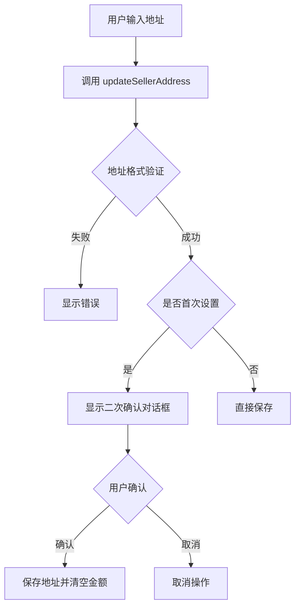
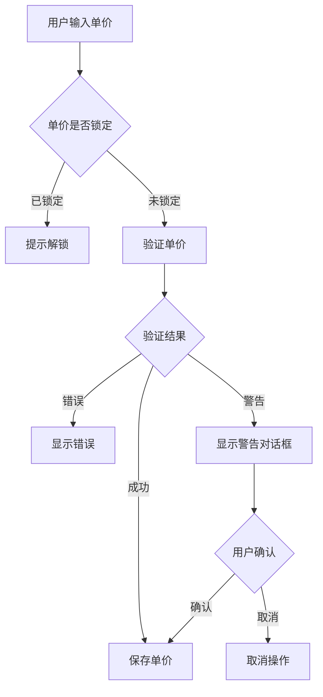
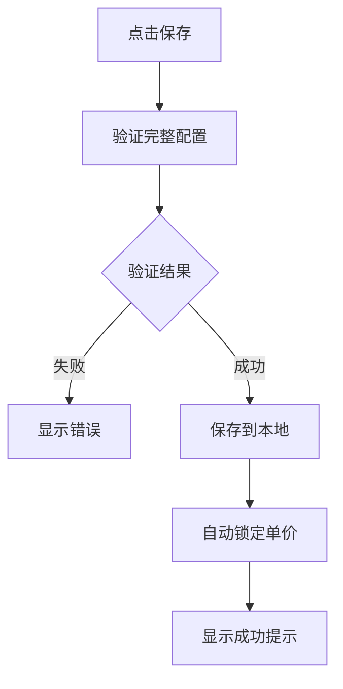

# Settings 模块使用指南

## 📋 概述

Settings 模块用于配置卖能量功能的相关参数，包括收款地址、单价和倍率。所有配置项都经过严格的验证，确保数据的安全性和合法性。

---

## 🏗️ 架构设计

### 核心组件

```
SettingsConfig (数据模型)
    ↓
SettingsValidator (验证器)
    ↓
SettingsViewModel (业务逻辑)
    ↓
SettingsRepository (数据存储)
    ↓
SettingsActivity (UI 层)
```

---

## 📦 数据模型

### SettingsConfig

```kotlin
data class SettingsConfig(
    val sellerAddress: String = "",           // 收款地址
    val pricePerUnitSun: Long = 0L,          // 单价（sun）
    val multiplier: Int = 1,                 // 倍率
    val isPriceLocked: Boolean = false,      // 单价锁定状态
    val isFirstTimeSetAddress: Boolean = true // 首次设置标志
)
```

**计算总金额**：
```kotlin
val totalAmountSun = config.getTotalAmountSun()
// totalAmountSun = pricePerUnitSun * multiplier
```

---

## ✅ 验证规则

### 1. 收款地址验证

```kotlin
// 规则：
// - 不能为空
// - 必须是有效的 TRON Base58 地址（T 开头，34 位）
// - 禁止合约地址

// 示例：
val result = validator.validateSellerAddress("TXYZoPE5CP4Gj4K...")
when (result) {
    is SettingsValidationResult.Success -> { /* 验证通过 */ }
    is SettingsValidationResult.Error -> { /* 显示错误信息 */ }
}
```

**首次设置二次确认**：
```kotlin
// 第一次设置地址时会触发二次确认
viewModel.updateSellerAddress("TXYZoPE5CP4Gj4K...", isFirstTime = true)

// 监听 UI 状态
when (uiState) {
    is SettingsUiState.RequireAddressConfirmation -> {
        // 显示确认对话框
        showAddressConfirmationDialog(uiState.address)
    }
}
```

**修改地址清空金额**：
```kotlin
// 修改地址时自动清空单价和倍率配置
// pricePerUnitSun = 0L
// isPriceLocked = false
```

---

### 2. 单价验证

```kotlin
// 规则：
// - 范围：1000 ～ 10_000_000 sun (0.001 ～ 10 TRX)
// - > 10 TRX 时触发警告，需用户确认

// 示例：
val (result, priceSun) = validator.validatePriceInput("5.5")
when (result) {
    is SettingsValidationResult.Success -> {
        // priceSun = 5_500_000L
    }
    is SettingsValidationResult.Warning -> {
        // 显示警告对话框，用户确认后才保存
    }
    is SettingsValidationResult.Error -> {
        // 显示错误信息
    }
}
```

**单价锁定机制**：
```kotlin
// 保存配置后自动锁定
viewModel.saveConfig()
// isPriceLocked = true

// 解锁后才能修改
viewModel.unlockPrice()
// isPriceLocked = false

// 锁定状态下尝试修改会提示错误
viewModel.updatePrice("6.0") // 如果已锁定，会返回错误
```

---

### 3. 倍率验证

```kotlin
// 规则：
// - 范围：1 ～ 10（整数）
// - 修改倍率不影响单价锁定状态

// 示例：
val (result, multiplier) = validator.validateMultiplierInput("3")
when (result) {
    is SettingsValidationResult.Success -> {
        // multiplier = 3
    }
    is SettingsValidationResult.Error -> {
        // 显示错误信息
    }
}
```

---

## 🎯 使用示例

### 基础使用流程

```kotlin
// 1. 创建 ViewModel
val repository = SettingsRepository(context)
val viewModel = SettingsViewModel(repository = repository)

// 2. 设置收款地址
viewModel.updateSellerAddress("TXYZoPE5CP4Gj4K...")

// 3. 观察状态，处理二次确认
lifecycleScope.launch {
    viewModel.uiState.collectLatest { state ->
        when (state) {
            is SettingsUiState.RequireAddressConfirmation -> {
                // 显示确认对话框
                showConfirmDialog(state.address) {
                    viewModel.confirmSellerAddress(state.address)
                }
            }
        }
    }
}

// 4. 设置单价
viewModel.updatePrice("5.5")

// 5. 观察状态，处理警告确认
when (uiState) {
    is SettingsUiState.RequirePriceConfirmation -> {
        // 显示警告对话框
        showWarningDialog(uiState.priceSun, uiState.warningMessage) {
            viewModel.confirmPrice(uiState.priceSun)
        }
    }
}

// 6. 设置倍率
viewModel.updateMultiplier("3")

// 7. 保存配置（自动锁定单价）
viewModel.saveConfig()

// 8. 解锁单价
viewModel.unlockPrice()
```

### 在 Activity 中使用

```kotlin
class SettingsActivity : AppCompatActivity() {
    
    private lateinit var viewModel: SettingsViewModel
    
    override fun onCreate(savedInstanceState: Bundle?) {
        super.onCreate(savedInstanceState)
        
        // 初始化
        val repository = SettingsRepository(this)
        viewModel = SettingsViewModel(repository = repository)
        
        // 观察配置状态
        lifecycleScope.launch {
            viewModel.configState.collectLatest { config ->
                // 更新 UI
                tvTotalAmount.text = "总金额：${config.getTotalAmountTrx()} TRX"
                etPrice.isEnabled = !config.isPriceLocked
            }
        }
        
        // 观察 UI 状态
        lifecycleScope.launch {
            viewModel.uiState.collectLatest { state ->
                handleUiState(state)
            }
        }
        
        // 按钮点击
        btnSave.setOnClickListener {
            viewModel.saveConfig()
        }
    }
}
```

---

## 🔄 完整交互流程

### 流程 1：首次设置地址



### 流程 2：设置单价



### 流程 3：保存配置



---

## 📝 完整代码示例

### ViewModel 使用示例

```kotlin
// 在 ViewModel 中调用
class SettingsViewModel : ViewModel() {
    
    // 1. 更新地址
    fun updateAddress(address: String) {
        val result = validator.validateSellerAddress(address)
        if (result is SettingsValidationResult.Success) {
            _configState.value = _configState.value.copy(
                sellerAddress = address,
                pricePerUnitSun = 0L, // 清空
                isPriceLocked = false  // 解锁
            )
        }
    }
    
    // 2. 更新单价
    fun updatePrice(priceStr: String) {
        if (_configState.value.isPriceLocked) {
            _uiState.value = SettingsUiState.Error("单价已锁定")
            return
        }
        
        val (result, priceSun) = validator.validatePriceInput(priceStr)
        when (result) {
            is SettingsValidationResult.Success -> {
                _configState.value = _configState.value.copy(
                    pricePerUnitSun = priceSun!!
                )
            }
            is SettingsValidationResult.Warning -> {
                _uiState.value = SettingsUiState.RequirePriceConfirmation(
                    priceSun!!, 
                    result.message
                )
            }
        }
    }
    
    // 3. 计算总金额
    fun calculateTotal(): Long {
        return _configState.value.getTotalAmountSun()
    }
}
```

---

## ⚠️ 注意事项

1. **地址修改会清空金额配置**：修改收款地址时，单价和锁定状态会被重置
2. **单价锁定后需手动解锁**：保存配置后单价自动锁定，修改前必须先解锁
3. **倍率修改不影响锁定**：可以随时修改倍率，不会解锁单价
4. **所有金额使用 long 类型**：内部使用 sun 为单位，显示时转换为 TRX
5. **验证失败直接拒绝**：任何验证失败都会拒绝保存，不会部分保存

---

## 🧪 测试用例

```kotlin
// 测试地址验证
@Test
fun testAddressValidation() {
    val validator = SettingsValidator()
    
    // 正确地址
    val result1 = validator.validateSellerAddress("TXYZoPE5CP4Gj4K...")
    assertTrue(result1 is SettingsValidationResult.Success)
    
    // 空地址
    val result2 = validator.validateSellerAddress("")
    assertTrue(result2 is SettingsValidationResult.Error)
    
    // 格式错误
    val result3 = validator.validateSellerAddress("invalid")
    assertTrue(result3 is SettingsValidationResult.Error)
}

// 测试单价验证
@Test
fun testPriceValidation() {
    val validator = SettingsValidator()
    
    // 正常单价
    val (result1, price1) = validator.validatePriceInput("5.5")
    assertTrue(result1 is SettingsValidationResult.Success)
    assertEquals(5_500_000L, price1)
    
    // 超过阈值
    val (result2, price2) = validator.validatePriceInput("15.0")
    assertTrue(result2 is SettingsValidationResult.Warning)
}
```

---

**创建时间**: 2025-12-25  
**版本**: 1.0.0
