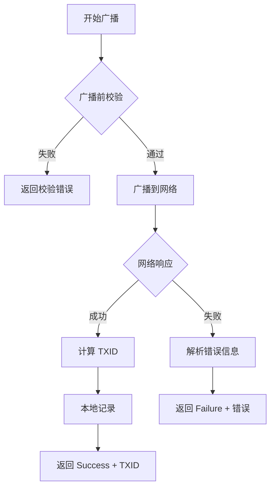

# 交易广播模块使用指南

## 📋 概述

交易广播模块负责将已签名的交易广播到 TRON 网络，并记录交易历史。

---

## 🔒 广播前校验

### 强制校验项

```kotlin
1. 交易已签名（signatureCount > 0）
2. 仅包含一个合约
3. 合约类型为 TransferContract
4. 金额匹配：amount == pricePerUnitSun × multiplier
5. 交易未过期
```

**关键校验**：
```kotlin
val actualAmount = transferContract.amount
val expectedAmount = config.pricePerUnitSun * config.multiplier

if (actualAmount != expectedAmount) {
    throw BroadcastException("金额校验失败")
}
```

---

## 📦 核心组件

### TransactionBroadcaster

**功能**：
- 广播前校验
- 广播到 TRON 网络
- 处理广播结果
- 本地记录交易

**方法**：
```kotlin
suspend fun broadcast(
    transaction: Chain.Transaction,
    config: SettingsConfig
): BroadcastResult
```

---

### TransactionRecord

**交易记录数据模型**：
```kotlin
data class TransactionRecord(
    val txid: String,
    val toAddress: String,
    val amountSun: Long,
    val timestamp: Long,
    val status: TransactionStatus,
    val memo: String = ""
)
```

---

### TransactionRecorder

**交易记录器**：
- 本地存储交易历史（SharedPreferences）
- 最多保留 100 条记录
- 支持按时间、状态查询

---

## 🎯 使用示例

### 基础使用

```kotlin
// 1. 创建广播器
val apiWrapper = ApiWrapper("grpc.trongrid.io:50051")
val broadcaster = TransactionBroadcaster(context, apiWrapper)

// 2. 广播交易
lifecycleScope.launch {
    val result = broadcaster.broadcast(
        transaction = signedTransaction,
        config = settingsConfig
    )
    
    when (result) {
        is BroadcastResult.Success -> {
            // 成功
            showSuccess("交易成功！TXID: ${result.txid}")
        }
        
        is BroadcastResult.Failure -> {
            // 失败
            showError(result.message)
        }
    }
}
```

---

### 完整流程示例

```kotlin
class TransferActivity : AppCompatActivity() {
    
    private lateinit var broadcaster: TransactionBroadcaster
    private lateinit var config: SettingsConfig
    
    override fun onCreate(savedInstanceState: Bundle?) {
        super.onCreate(savedInstanceState)
        
        // 初始化广播器
        val apiWrapper = ApiWrapper("grpc.trongrid.io:50051")
        broadcaster = TransactionBroadcaster(this, apiWrapper)
    }
    
    // 执行完整转账流程
    private fun performTransfer() {
        lifecycleScope.launch {
            try {
                // 1. 构造交易
                val transaction = TransactionBuilder().buildTransferTransaction(
                    fromAddress = walletManager.getAddress()!!,
                    config = config
                )
                
                // 2. 风控检查
                val riskResult = RiskValidator().checkRisk(transaction, config)
                if (riskResult.level == RiskLevel.BLOCK) {
                    showError(riskResult.message)
                    return@launch
                }
                
                // 3. 显示确认对话框
                TransferConfirmDialog(
                    context = this@TransferActivity,
                    config = config,
                    fromAddress = walletManager.getAddress()!!,
                    onConfirmed = {
                        // 4. 签名
                        signAndBroadcastTransaction(transaction)
                    }
                ).show()
                
            } catch (e: Exception) {
                showError("交易失败：${e.message}")
            }
        }
    }
    
    // 签名并广播
    private fun signAndBroadcastTransaction(transaction: Chain.Transaction) {
        lifecycleScope.launch {
            try {
                // 签名
                val signedTx = walletManager.signTransferContract(transaction)
                
                // 广播
                val result = broadcaster.broadcast(signedTx, config)
                
                when (result) {
                    is BroadcastResult.Success -> {
                        handleBroadcastSuccess(result)
                    }
                    
                    is BroadcastResult.Failure -> {
                        handleBroadcastFailure(result)
                    }
                }
                
            } catch (e: SecurityException) {
                showError("签名失败：${e.message}")
            }
        }
    }
    
    // 处理广播成功
    private fun handleBroadcastSuccess(result: BroadcastResult.Success) {
        // 显示成功信息
        AlertDialog.Builder(this)
            .setTitle("交易成功")
            .setMessage("""
                交易已广播成功！
                
                TXID: ${result.txid}
                金额: ${AmountUtils.sunToTrx(config.getTotalAmountSun())} TRX
                
                请在区块浏览器查看交易状态。
            """.trimIndent())
            .setPositiveButton("确定") { _, _ ->
                finish()
            }
            .show()
    }
    
    // 处理广播失败
    private fun handleBroadcastFailure(result: BroadcastResult.Failure) {
        // 显示错误信息
        AlertDialog.Builder(this)
            .setTitle("广播失败")
            .setMessage(result.message)
            .setPositiveButton("确定", null)
            .show()
    }
}
```

---

## 📊 交易历史查询

### 获取所有记录

```kotlin
val records = broadcaster.getTransactionHistory()
records.forEach { record ->
    println("TXID: ${record.txid}")
    println("金额: ${AmountUtils.sunToTrx(record.amountSun)} TRX")
    println("状态: ${record.status}")
}
```

### 获取今日交易

```kotlin
val recorder = TransactionRecorder(context)
val todayRecords = recorder.getTodayRecords()
println("今日交易数量：${todayRecords.size}")
```

### 统计成功交易

```kotlin
val successCount = recorder.getSuccessCount()
println("成功交易数：$successCount")
```

---

## 🚨 错误处理

### 常见错误及处理

**1. 金额校验失败**
```
错误：金额校验失败：期望 15000000 sun，实际 10000000 sun
处理：检查交易构造逻辑，确保金额正确
```

**2. 余额不足**
```
错误：余额不足
处理：提示用户充值
```

**3. 交易已过期**
```
错误：交易已过期
处理：重新构造交易
```

**4. 重复广播**
```
错误：交易已提交，请勿重复广播
处理：提示用户等待确认，不自动重试
```

**5. 签名验证失败**
```
错误：签名验证失败
处理：检查签名逻辑
```

---

## 💡 最佳实践

### 1. 不自动重试

```kotlin
// ❌ 错误做法
fun broadcastWithRetry(transaction: Chain.Transaction) {
    repeat(3) {
        try {
            broadcast(transaction)
            return
        } catch (e: Exception) {
            // 继续重试
        }
    }
}

// ✅ 正确做法
fun broadcast(transaction: Chain.Transaction) {
    // 仅广播一次，失败由用户决定是否重试
}
```

### 2. 明确错误提示

```kotlin
// ✅ 解析技术错误为用户友好提示
private fun parseErrorMessage(errorMessage: String): String {
    return when {
        errorMessage.contains("balance is not sufficient") ->
            "余额不足"
        // ...
        else -> "广播失败：$errorMessage"
    }
}
```

### 3. 本地记录

```kotlin
// ✅ 广播成功后立即记录
fun handleSuccess(transaction: Chain.Transaction) {
    val record = TransactionRecord(...)
    transactionRecorder.saveRecord(record)
}
```

---

## 🔄 完整流程图



---

**创建时间**: 2025-12-25  
**版本**: 1.0.0
