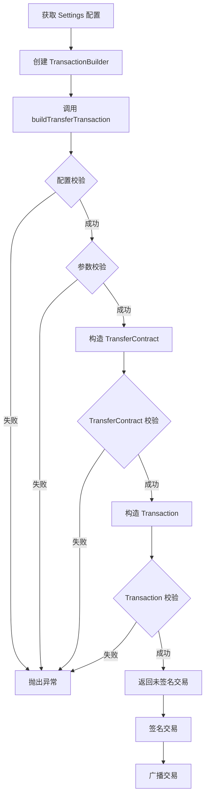

# TRX 交易构造器使用指南

## 📋 概述

TransactionBuilder 是一个严格安全的 TRX 交易构造器，仅允许构造符合特定规则的 TransferContract（TRX 普通转账）交易。

---

## 🔒 硬性安全约束

### 1. 仅允许 TransferContract
- ✅ **仅支持** TRX 普通转账
- ❌ **禁止** 智能合约调用
- ❌ **禁止** TRC20 转账
- ❌ **禁止** 任何其他交易类型

### 2. 固定参数
- **from**: 当前钱包地址
- **to**: Settings 配置的 sellerAddress
- **amount**: pricePerUnitSun × multiplier（long 类型）

### 3. 构造前强制校验
- `amount > 0`
- `amount == pricePerUnitSun * multiplier`
- `to == sellerAddress`
- 不包含 data 字段
- 不包含任何合约字段

### 4. 任一校验失败直接拒绝
- 抛出 `TransactionBuildException`
- 不会构造交易
- 不会返回部分结果

---

## 🏗️ 架构设计

```
SettingsConfig（配置）
    ↓
TransactionBuilder（构造器）
    ↓
构造前校验
    ↓
构造 TransferContract
    ↓
构造后校验
    ↓
TransactionValidator（最终验证）
    ↓
返回未签名交易
```

---

## 📦 核心类

### TransactionBuilder

**主要方法**：
```kotlin
fun buildTransferTransaction(
    fromAddress: String,
    config: SettingsConfig
): Chain.Transaction
```

**功能**：
1. 验证 Settings 配置完整性
2. 验证交易参数（地址、金额）
3. 构造 TransferContract
4. 验证构造的交易
5. 返回未签名交易

**异常**：
- `TransactionBuildException`: 构造失败时抛出

---

### TransactionValidator

**主要方法**：
```kotlin
fun validateTransactionWithConfig(
    transaction: Chain.Transaction,
    config: SettingsConfig,
    fromAddress: String
): ValidationResult
```

**功能**：
1. 验证交易基础结构
2. 验证交易类型为 TransferContract
3. 验证 TransferContract 内容与配置一致
4. 验证没有多余字段（data、scripts 等）

**异常**：
- `TransactionValidationException`: 验证失败时抛出

---

## 🎯 使用示例

### 基础使用

```kotlin
// 1. 准备配置
val config = SettingsConfig(
    sellerAddress = "TXYZoPE5CP4Gj4K...",  // 收款地址
    pricePerUnitSun = 5_000_000L,          // 单价：5 TRX
    multiplier = 3,                         // 倍率：3
    isPriceLocked = true,
    isFirstTimeSetAddress = false
)

// 2. 创建构造器
val builder = TransactionBuilder()

// 3. 构造交易
try {
    val transaction = builder.buildTransferTransaction(
        fromAddress = "TAbcdeFGHIJKLMNO...",  // 当前钱包地址
        config = config
    )
    
    // 4. 交易构造成功
    println("交易构造成功")
    println("总金额：${config.getTotalAmountSun()} sun")
    
    // 5. 后续步骤：签名交易
    // ...
    
} catch (e: TransactionBuildException) {
    // 6. 构造失败，处理错误
    println("交易构造失败：${e.message}")
}
```

---

### 完整流程（含验证）

```kotlin
// 1. 创建构造器和验证器
val builder = TransactionBuilder()
val validator = TransactionValidator()

// 2. 准备配置
val config = SettingsConfig(
    sellerAddress = "TXYZoPE5CP4Gj4K...",
    pricePerUnitSun = 5_000_000L,
    multiplier = 3
)

val fromAddress = "TAbcdeFGHIJKLMNO..."

try {
    // 3. 构造交易
    val transaction = builder.buildTransferTransaction(fromAddress, config)
    
    // 4. 最终验证（可选，构造器已包含验证）
    val validationResult = validator.validateTransactionWithConfig(
        transaction = transaction,
        config = config,
        fromAddress = fromAddress
    )
    
    when (validationResult) {
        is ValidationResult.Success -> {
            println("验证通过：${validationResult.message}")
            
            // 5. 签名交易
            // val signedTransaction = signer.signTransaction(transaction, keyPair)
        }
        is ValidationResult.Failure -> {
            println("验证失败：${validationResult.message}")
        }
    }
    
} catch (e: TransactionBuildException) {
    println("构造失败：${e.message}")
} catch (e: TransactionValidationException) {
    println("验证失败：${e.message}")
}
```

---

### 在 ViewModel 中使用

```kotlin
class TransferViewModel : ViewModel() {
    
    private val builder = TransactionBuilder()
    
    fun createTransferTransaction(
        fromAddress: String,
        config: SettingsConfig
    ) {
        viewModelScope.launch {
            try {
                // 构造交易
                val transaction = builder.buildTransferTransaction(
                    fromAddress = fromAddress,
                    config = config
                )
                
                // 更新 UI 状态
                _uiState.value = TransferUiState.TransactionReady(transaction)
                
            } catch (e: TransactionBuildException) {
                // 显示错误
                _uiState.value = TransferUiState.Error(e.message ?: "构造交易失败")
            }
        }
    }
}
```

---

## ✅ 校验详解

### 配置校验（validateConfig）

```kotlin
// 检查项：
1. config.isConfigComplete() == true
2. config.sellerAddress.isNotEmpty()
3. config.pricePerUnitSun > 0
4. config.multiplier > 0

// 任一检查失败：
throw TransactionBuildException("配置无效")
```

### 参数校验（validateTransactionParams）

```kotlin
// 检查项：
1. amountSun > 0
2. amountSun == config.pricePerUnitSun * config.multiplier
3. toAddress == config.sellerAddress
4. fromAddress 格式正确（T 开头，34 位）
5. toAddress 格式正确
6. fromAddress != toAddress

// 任一检查失败：
throw TransactionBuildException("参数无效")
```

### TransferContract 校验（validateTransferContract）

```kotlin
// 检查项：
1. ownerAddress 不为空
2. toAddress 不为空
3. amount > 0
4. 不包含 data 字段

// 任一检查失败：
throw TransactionBuildException("TransferContract 无效")
```

### 交易校验（validateBuiltTransaction）

```kotlin
// 检查项：
1. 包含 RawData
2. 仅包含一个合约（contractCount == 1）
3. 合约类型为 TransferContract
4. timestamp > 0
5. expiration > timestamp

// 任一检查失败：
throw TransactionBuildException("交易无效")
```

---

## 🚨 错误处理

### 常见错误及处理

**1. 配置不完整**
```kotlin
TransactionBuildException: Settings 配置不完整

原因：
- sellerAddress 为空
- pricePerUnitSun <= 0
- multiplier <= 0

解决：
确保 Settings 配置完整并保存
```

**2. 金额不匹配**
```kotlin
TransactionBuildException: 转账金额不匹配

原因：
实际金额 != pricePerUnitSun * multiplier

解决：
使用 config.getTotalAmountSun() 获取正确金额
```

**3. 地址不匹配**
```kotlin
TransactionBuildException: 接收地址不匹配

原因：
toAddress != config.sellerAddress

解决：
确保使用配置中的 sellerAddress
```

**4. 地址格式错误**
```kotlin
TransactionBuildException: 地址格式错误

原因：
- 地址不以 T 开头
- 地址长度不是 34 位
- Base58 解码失败

解决：
使用有效的 TRON 地址
```

**5. 发送方和接收方相同**
```kotlin
TransactionBuildException: 发送方和接收方地址不能相同

原因：
fromAddress == toAddress

解决：
检查地址配置
```

---

## 🔄 完整交易流程



---

## 📝 测试

### 单元测试示例

```kotlin
@Test(expected = TransactionBuildException::class)
fun `测试空配置应抛出异常`() {
    val builder = TransactionBuilder()
    val emptyConfig = SettingsConfig()
    
    builder.buildTransferTransaction("TXYZoPE5...", emptyConfig)
}

@Test
fun `测试正常金额计算`() {
    val config = SettingsConfig(
        sellerAddress = "TAbcdeFGHI...",
        pricePerUnitSun = 5_000_000L,
        multiplier = 3
    )
    
    assertEquals(15_000_000L, config.getTotalAmountSun())
}
```

---

## ⚠️ 重要提示

1. **不可绕过的校验**：所有校验都是强制的，无法禁用或跳过
2. **异常必须处理**：任何异常都表示构造失败，不会返回交易
3. **配置必须完整**：使用前确保 Settings 配置已正确设置
4. **地址必须真实**：测试时使用真实的 TRON 地址
5. **金额严格匹配**：amount 必须完全等于 pricePerUnitSun × multiplier

---

**创建时间**: 2025-12-25  
**版本**: 1.0.0
