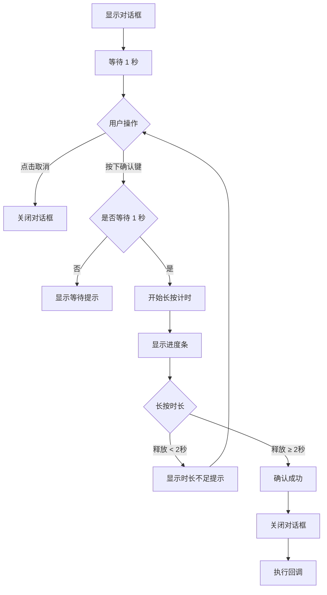

# 转账确认弹窗使用指南

## 📋 概述

TransferConfirmDialog 是一个高安全性的转账确认对话框，通过长按确认机制防止误操作。

---

## 🔒 安全特性

### 1. **禁止返回键关闭**
```kotlin
setCancelable(false)
setCanceledOnTouchOutside(false)
```
用户无法通过返回键或点击外部区域关闭对话框，必须主动选择"确认"或"取消"。

### 2. **禁止 1 秒内确认**
```kotlin
const val MIN_WAIT_TIME_MS = 1000L
```
对话框显示后，必须等待至少 1 秒才能开始确认操作，防止快速点击误操作。

### 3. **必须长按 2 秒确认**
```kotlin
const val LONG_PRESS_DURATION_MS = 2000L
```
用户必须长按确认按钮 2 秒钟，只有达到时长才会触发确认操作。

---

## 📱 显示内容

### 交易详情
- **交易类型**: TRX 普通转账
- **收款地址**: 完整的 TRON 地址
- **单价**: X TRX
- **倍率**: ×N
- **总金额**: X TRX（高亮显示）

### 安全提示
- ✓ 不会授权资产
- ✓ 不会调用合约

---

## 🎯 使用示例

### 基础使用

```kotlin
// 1. 准备配置
val config = SettingsConfig(
    sellerAddress = "TXYZoPE5CP4Gj4K...",
    pricePerUnitSun = 5_000_000L,
    multiplier = 3
)

// 2. 创建对话框
val dialog = TransferConfirmDialog(
    context = this,
    config = config,
    fromAddress = walletAddress,
    onConfirmed = {
        // 用户确认后的回调
        proceedWithTransaction()
    }
)

// 3. 显示对话框
dialog.show()
```

---

### 在 Activity 中使用

```kotlin
class TransferActivity : AppCompatActivity() {
    
    private fun showTransferConfirmDialog() {
        val dialog = TransferConfirmDialog(
            context = this,
            config = settingsConfig,
            fromAddress = currentWalletAddress,
            onConfirmed = {
                // 确认后签名并广播交易
                signAndBroadcastTransaction()
            }
        )
        
        dialog.show()
    }
    
    private fun signAndBroadcastTransaction() {
        lifecycleScope.launch {
            try {
                // 签名交易
                val signedTransaction = signer.signTransaction(transaction, keyPair)
                
                // 广播交易
                broadcastTransaction(signedTransaction)
                
            } catch (e: Exception) {
                showError("交易失败：${e.message}")
            }
        }
    }
}
```

---

### 在 ViewModel 中使用

```kotlin
class TransferViewModel : ViewModel() {
    
    private val _showConfirmDialog = MutableLiveData<SettingsConfig?>()
    val showConfirmDialog: LiveData<SettingsConfig?> = _showConfirmDialog
    
    fun requestTransfer(config: SettingsConfig) {
        // 触发显示确认对话框
        _showConfirmDialog.value = config
    }
    
    fun onTransferConfirmed() {
        viewModelScope.launch {
            // 执行转账逻辑
            performTransfer()
        }
    }
}

// 在 Activity 中观察
viewModel.showConfirmDialog.observe(this) { config ->
    config?.let {
        val dialog = TransferConfirmDialog(
            context = this,
            config = it,
            fromAddress = walletAddress,
            onConfirmed = {
                viewModel.onTransferConfirmed()
            }
        )
        dialog.show()
    }
}
```

---

## 🔄 交互流程



---

## 💡 长按确认机制详解

### 按下事件（ACTION_DOWN）

```kotlin
handlePressDown() {
    // 1. 检查是否等待足够时间
    if (elapsedTime < MIN_WAIT_TIME_MS) {
        显示等待提示
        return
    }
    
    // 2. 开始长按
    isLongPressing = true
    longPressStartTime = System.currentTimeMillis()
    
    // 3. 显示进度条
    progressBar.visibility = VISIBLE
    
    // 4. 启动进度更新
    startProgressUpdate()
}
```

### 释放事件（ACTION_UP）

```kotlin
handlePressUp() {
    // 1. 停止长按
    isLongPressing = false
    stopProgressUpdate()
    
    // 2. 检查长按时长
    pressDuration = currentTime - longPressStartTime
    
    if (pressDuration >= LONG_PRESS_DURATION_MS) {
        // 确认成功
        onConfirmSuccess()
    } else {
        // 时长不足，重置
        resetProgress()
        显示时长不足提示
    }
}
```

### 进度更新

```kotlin
startProgressUpdate() {
    每 50ms 更新一次：
        - 计算当前进度百分比
        - 更新进度条显示
        - 如果进度 < 100%，继续更新
}
```

---

## 🎨 UI 组件说明

### 主要组件

| 组件 | ID | 功能 |
|------|-----|------|
| 标题 | - | 显示"确认转账" |
| 交易类型 | tvTransactionType | 显示"TRX 普通转账" |
| 收款地址 | tvRecipientAddress | 显示完整地址 |
| 单价 | tvPricePerUnit | 显示单价 |
| 倍率 | tvMultiplier | 显示倍率 |
| 总金额 | tvTotalAmount | 高亮显示总金额 |
| 警告1 | tvWarning1 | "不会授权资产" |
| 警告2 | tvWarning2 | "不会调用合约" |
| 提示文本 | tvHoldPrompt | 动态提示信息 |
| 进度条 | progressBar | 长按进度 |
| 确认按钮 | btnConfirm | 长按确认 |
| 取消按钮 | btnCancel | 取消操作 |

---

## 🚨 用户体验流程

### 正常流程

1. 用户点击"转账"按钮
2. 显示确认对话框
3. 用户阅读交易详情（强制等待 1 秒）
4. 用户长按"长按 2 秒确认"按钮
5. 进度条开始增长
6. 达到 2 秒后自动确认
7. 对话框关闭，执行转账

### 快速点击场景

1. 对话框刚显示
2. 用户立即点击确认
3. 显示：**"请等待 X 秒后再确认"**
4. 用户需要等待

### 长按不足场景

1. 用户长按 1.5 秒后释放
2. 进度条重置
3. 显示：**"长按时间不足，还需 0.5 秒"**
4. 用户需要重新长按

---

## 📝 自定义配置

### 修改时间常量

```kotlin
class TransferConfirmDialog(...) {
    companion object {
        // 修改最短等待时间（默认 1 秒）
        private const val MIN_WAIT_TIME_MS = 2000L  // 改为 2 秒
        
        // 修改长按时长（默认 2 秒）
        private const val LONG_PRESS_DURATION_MS = 3000L  // 改为 3 秒
        
        // 修改进度更新间隔（默认 50ms）
        private const val PROGRESS_UPDATE_INTERVAL_MS = 100L  // 改为 100ms
    }
}
```

### 自定义样式

在 `values/themes.xml` 中添加：

```xml
<style name="TransferConfirmDialogTheme" parent="Theme.MaterialComponents.Dialog">
    <item name="android:windowBackground">@android:color/transparent</item>
    <item name="android:backgroundDimEnabled">true</item>
</style>
```

---

## 🧪 测试场景

```kotlin
// 测试 1：验证时间常量
@Test
fun testTimeConstants() {
    assertEquals(1000L, MIN_WAIT_TIME_MS)
    assertEquals(2000L, LONG_PRESS_DURATION_MS)
}

// 测试 2：验证配置绑定
@Test
fun testConfigBinding() {
    val config = SettingsConfig(
        pricePerUnitSun = 5_000_000L,
        multiplier = 3
    )
    assertEquals(15_000_000L, config.getTotalAmountSun())
}
```

---

## ⚠️ 注意事项

1. **不要在主线程执行耗时操作**：
   ```kotlin
   onConfirmed = {
       lifecycleScope.launch {
           // 异步执行转账逻辑
       }
   }
   ```

2. **确保 Config 完整**：
   ```kotlin
   if (!config.isConfigComplete()) {
       showError("配置不完整")
       return
   }
   ```

3. **处理 Activity 生命周期**：
   ```kotlin
   override fun onDestroy() {
       dialog?.dismiss()
       super.onDestroy()
   }
   ```

---

**创建时间**: 2025-12-25  
**版本**: 1.0.0
